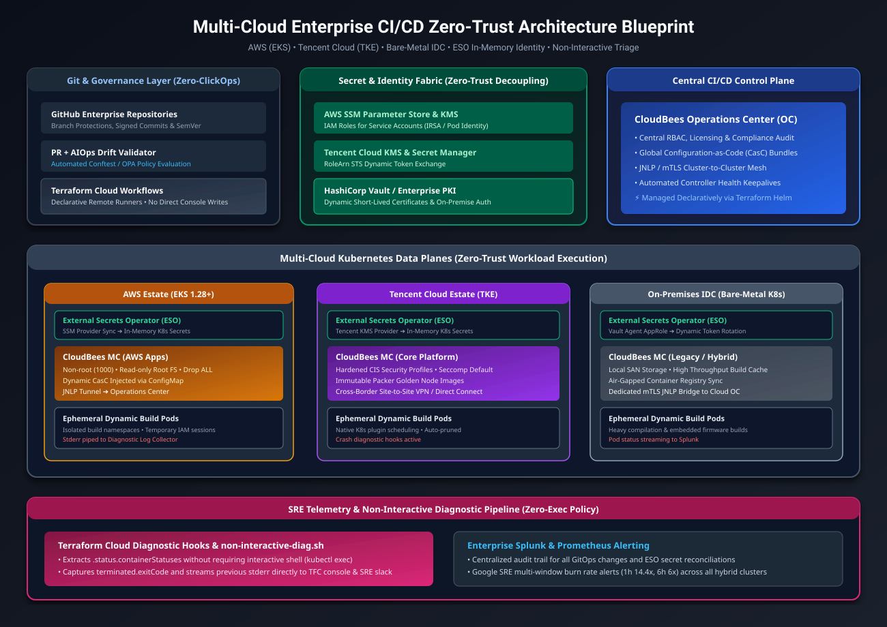
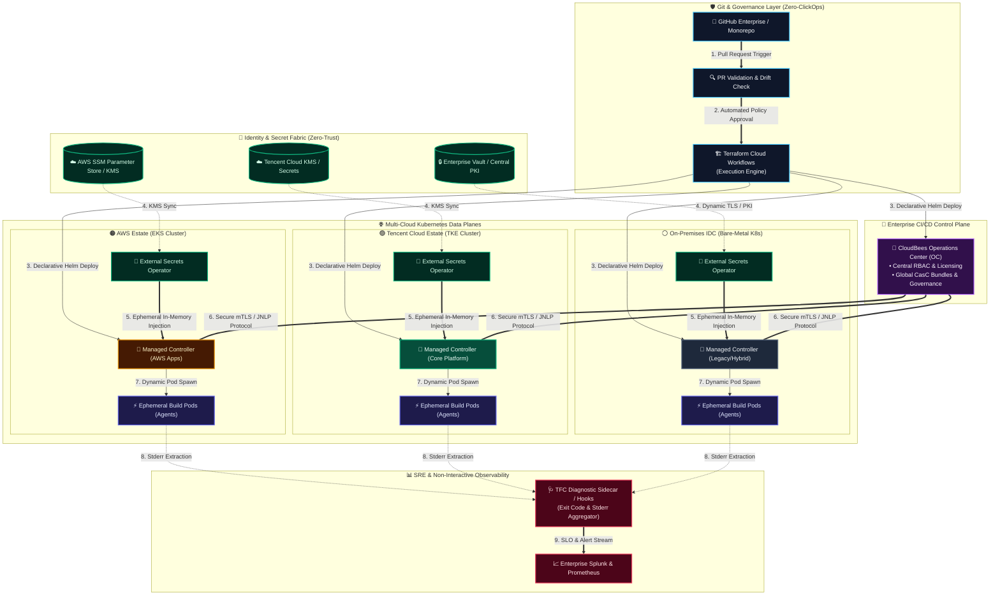

# Enterprise Multi-Cloud CI/CD Zero-Trust Architecture Blueprint

> **Hands-on Runnable Lab**: To run the local multi-node Kind & GitOps sandbox reproducing this architecture, visit [hybrid-gitops-sre-lab](https://github.com/GRayMillerDes/hybrid-gitops-sre-lab).

This repository contains the architectural blueprints, technical retrospectives, security guardrails, and topology specifications for an enterprise multi-cloud CI/CD platform engineered under strict financial least-privilege policies.

---

## 🗺️ Architectural Topology

---

## 🎯 How to Use This Repository (Reading & Navigation Guide)

Depending on your role and objectives, here is the recommended path through this blueprint:

| Your Persona / Objective | Recommended Starting Point | Key Takeaway |
| :--- | :--- | :--- |
| **Recruiters / Engineering Leaders** | 💼 **[LinkedIn Pulse Retrospective](./articles/linkedin-pulse-article.md)** | High-level business context, executive summary of zero-trust wins, and SRE impact. |
| **Principal / Cloud-Native Architects** | 🗺️ **[Topology](./architecture/multicloud-cicd-topology.svg)** & 📖 **[Deep-Dive Architecture Guide](./architecture/architecture-deep-dive.md)** | Full technical breakdown of control plane separation, mTLS agent transport, and ESO secret sync. |
| **Security & Compliance Officers** | 🛡️ **[Least-Privilege RBAC Matrix](./specs/least-privilege-rbac-matrix.yaml)** & 📋 **[Zero-Trust Guardrails](./specs/zero-trust-guardrails.md)** | Auditable configurations enforcing zero-interactive-exec policies and CIS benchmark hardening. |
| **Hands-on Practitioners** | 🚀 **[hybrid-gitops-sre-lab](https://github.com/GRayMillerDes/hybrid-gitops-sre-lab)** | Jump into the runnable local sandbox to provision Kind, Argo CD, and test zero-secret workflows. |

---

## 📚 Core Repository Contents

- 📖 **[Deep-Dive Architecture Guide](./architecture/architecture-deep-dive.md)**: Technical breakdown of control plane vs data plane segregation, JNLP mTLS networking, and in-memory secret lifecycle.
- 💼 **[LinkedIn Pulse Ready Article](./articles/linkedin-pulse-article.md)**: English technical retrospective formatted specifically for LinkedIn Pulse and Featured sections.
- 🛡️ **[Least-Privilege RBAC Matrix](./specs/least-privilege-rbac-matrix.yaml)**: Declarative Kubernetes RBAC configurations enforcing zero-interactive-exec policies.
- 📋 **[Zero-Trust Guardrails](./specs/zero-trust-guardrails.md)**: Hardening benchmarks and automated drift detection specifications.

---

## 💡 Key Architectural Takeaways

1. **Eliminating the Terraform State Credential Leak**: Decoupled secret management via **External Secrets Operator (ESO)** ensures that zero credentials are committed to `terraform.tfstate`.
2. **The "No-kubectl" Dilemma**: Engineered automated diagnostic hooks within Terraform Cloud runners that inspect `.status.containerStatuses` and extract container exit codes and `--previous` stderr streams without granting shell access.
3. **Zero-ClickOps Compliance**: Automated golden machine image pipelines with **HashiCorp Packer** and exclusive declarative scheduling through **Terraform Cloud** revoke human write permissions to public cloud web consoles.

---

## 📄 License

Distributed under the Apache-2.0 License. See [LICENSE](./LICENSE) for details.
