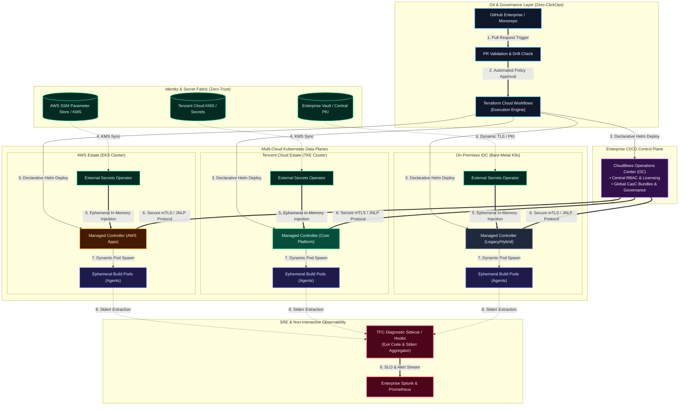
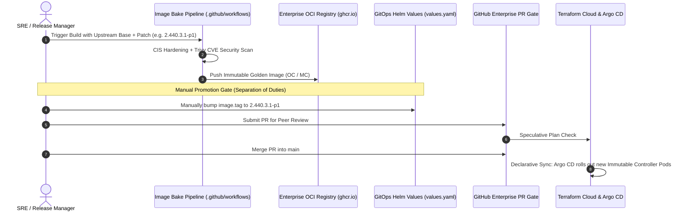

# Enterprise Multi-Cloud CI/CD Zero-Trust Architecture Blueprint

[](https://github.com/GRayMillerDes/multicloud-cicd-zero-trust-architecture)
[](https://external-secrets.io/)
[](https://aws.amazon.com/)
[](https://www.cloudbees.com/)
[](https://prometheus.io/)
[](https://opensource.org/licenses/Apache-2.0)

> **Hands-on Runnable Sandbox**: To deploy and test the local multi-node Kind & GitOps environment that mirrors this architecture, visit [hybrid-gitops-sre-lab](https://github.com/GRayMillerDes/hybrid-gitops-sre-lab).

This repository provides production-grade architectural blueprints, security guardrails, and VCS delivery specifications for an enterprise multi-cloud CI/CD platform engineered under strict financial least-privilege standards.

---

## 1. What Is This Architecture? (30-Second Primer)

If you are new to multi-cloud platform engineering, here is the problem and solution in simple terms:

* **The Problem**: Global enterprises run workloads across multiple clouds (AWS in North America, Tencent Cloud in APAC, and on-premises Bare-Metal IDCs). Traditional setups either:
  1. Store shared passwords in code/Terraform state, leading to **severe security leaks**.
  2. Grant engineers direct console/SSH/`kubectl exec` permissions, violating **financial compliance (PCI-DSS/ISO27001)**.
  3. Route build traffic across cloud boundaries, causing **high cross-cloud egress bills and network latency**.
* **The Solution**: A **Hub-and-Spoke Zero-Trust Architecture**:
  * **Central Hub (Control Plane)**: Manages global access, licenses, and RBAC from one place.
  * **Regional Spokes (Data Planes)**: Execute builds locally inside private VPCs in AWS, TKE, and IDC without cross-cloud network hops.
  * **In-Memory Secrets**: External Secrets Operator (ESO) pulls cloud KMS keys directly into cluster RAM. Passwords never touch Git or Terraform state files.

```text
[ Developer PR ] ──> [ GitHub Enterprise ] ──> [ Terraform Cloud ]
                                                        │
                      ┌─────────────────────────────────┴─────────────────────────────────┐
                      ▼                                                                   ▼
       [ Central Control Plane ]                                         [ Regional Data Planes ]
       • Single Sign-On & Global RBAC                                    • AWS EKS / TKE / IDC Workers
       • Outbound mTLS JNLP Hub                                          • Local VPC Build Pods (Zero Egress)
                                                                         • Ephemeral In-Memory Secrets (ESO)
```

---

## 2. Quickstart: Consuming & Applying This Blueprint

This repository is organized as an actionable engineering toolkit. You can evaluate and apply it progressively:

### Step 1: Test & Dry-Run the Security Policy (30 Seconds)
Validate the production zero-interactive-exec RBAC matrix against any Kubernetes cluster without making changes:
```bash
# Validates client-side syntax and least-privilege RBAC definitions
kubectl apply --dry-run=client -f ./specs/least-privilege-rbac-matrix.yaml
```

### Step 2: Spin Up the Local Reproduction Sandbox (3 Minutes)
Run the companion 3-node Kind cluster locally to test the architecture end-to-end with zero cloud cost:
```bash
git clone https://github.com/GRayMillerDes/hybrid-gitops-sre-lab.git
cd hybrid-gitops-sre-lab && ./scripts/setup-local-env.sh
```

### Step 3: Deep Dive into Specifications
- **[Deep-Dive Architecture Guide](./architecture/architecture-deep-dive.md)**: Full breakdown of control plane separation, mTLS tunnels, and in-memory secret lifecycle.
- **[Zero-Trust Guardrails](./specs/zero-trust-guardrails.md)**: CIS Kubernetes benchmark hardening rules and container isolation policies.
- **[Terraform Cloud VCS Spec](./specs/terraform-cloud-vcs-spec.md)**: Enterprise PR iteration, speculative plan checks, remote runners & zero-clickops.

---

## 3. High-Level Architectural Topology

The diagram below maps the separation between the central management plane and multi-cloud regional data planes:




---

## 4. Deep-Dive: Core Architectural Mechanisms

Detailed technical implementations are documented in **[architecture-deep-dive.md](./architecture/architecture-deep-dive.md)**. Below is an engineering overview of the 4 foundational pillars:

### Pillar I: Decoupled In-Memory Secret Delivery
* **Problem**: Passing secrets in Terraform Helm values embeds plaintext credentials into `.tfstate`, exposing passwords to anyone with state bucket access.
* **Solution**: External Secrets Operator (ESO) bridges cloud KMS systems directly into Kubernetes etcd in-memory. Sensitive data is injected into pod runtime memory without touching Git or Terraform state.

### Pillar II: Outbound-Only mTLS JNLP Networking
* **Problem**: Direct cross-cloud management usually requires opening risky public ingress ports or maintaining expensive full-mesh site-to-site VPNs.
* **Solution**: Managed Controllers in remote clouds initiate outbound-only TLS/mTLS tunnels back to the Operations Center. Private VPCs remain fully shielded from incoming public traffic.

### Pillar III: Traffic Localization & Zero Egress
* **Problem**: Running builds from a centralized cluster across public clouds introduces network latency and massive egress transfer bills.
* **Solution**: Build agents are spawned ephemerally inside the local Kubernetes cluster where source code, dependencies, and caches live. Cross-cloud network traffic is strictly limited to lightweight control plane signals.

### Pillar IV: Non-Interactive Troubleshooting (Zero-kubectl-exec)
* **Problem**: Regulatory audits (SOC 2, PCI-DSS) strictly prohibit SSH or `kubectl exec` shell access in production, leaving engineers without diagnostic tools during pod crashes.
* **Solution**: Automated CI/CD diagnostic workers query `.status.containerStatuses` to extract container termination exit codes (e.g. 137 for OOMKilled) and fetch previous stderr logs (`--previous`) automatically into pipeline outputs.

👉 *[Read Complete Architectural Specification →](./architecture/architecture-deep-dive.md)*

---

## 5. Release Governance: VCS Pipeline & Manual Helm Promotion

How infrastructure changes and controller upgrades move safely from code to production:



👉 *[Read Complete VCS & Promotion Specification →](./specs/terraform-cloud-vcs-spec.md)*

---

## 6. Security & Compliance Specifications Matrix

Production guardrails from **[least-privilege-rbac-matrix.yaml](./specs/least-privilege-rbac-matrix.yaml)** and **[zero-trust-guardrails.md](./specs/zero-trust-guardrails.md)**:

| Compliance Domain | Enforced Specification | Implementation Artifact | Threat Prevented |
| :--- | :--- | :--- | :--- |
| **Interactive Access** | Zero `kubectl exec` / `attach` | [`least-privilege-rbac-matrix.yaml`](./specs/least-privilege-rbac-matrix.yaml) | Eliminates shell escalation & unauthorized data tampering (PCI-DSS) |
| **Container Sandbox** | `readOnlyRootFilesystem: true`, `drop: ALL` | [`zero-trust-guardrails.md`](./specs/zero-trust-guardrails.md) | Blocks malicious binary downloads & Linux kernel privilege escalation |
| **Workload Identity** | Non-root UID `1000`, `RuntimeDefault` seccomp | [`zero-trust-guardrails.md`](./specs/zero-trust-guardrails.md) | Prevents container breakout to host node |
| **State Sanitization** | External Secrets Operator (In-Memory K8s Secrets) | [`architecture-deep-dive.md`](./architecture/architecture-deep-dive.md) | Prevents credential leaks in `terraform.tfstate` |
| **Version Drift** | No `:latest` tags / Explicit semver in Git | [`terraform-cloud-vcs-spec.md`](./specs/terraform-cloud-vcs-spec.md) | Guarantees reproducible builds & instant deterministic rollbacks |

---

## 7. Architectural Decision Records (ADR) Summary

| Decision ID | Context & Problem | Decision Made | Trade-offs & Consequences |
| :--- | :--- | :--- | :--- |
| **ADR-001** | Terraform state files store credentials in plaintext when using `helm_release` values. | Adopt External Secrets Operator (ESO) with ephemeral in-memory K8s secrets. | Slightly higher initial CRD reconciliation complexity; completely eliminates credential leakage in CI/CD state. |
| **ADR-002** | Financial compliance forbids `kubectl exec` / SSH into production worker nodes. | Implement non-interactive diagnostic sidecars and stderr extractors in CI runners. | Eliminates manual ad-hoc troubleshooting; enforces deterministic RCA and structured logging. |
| **ADR-003** | Multi-cloud latency and network isolation across AWS, Tencent Cloud, and IDC. | Centralize Control Plane (CloudBees OC) and distribute Data Plane controllers per cloud. | Requires outbound-only mTLS JNLP connectivity; local build pods avoid cross-cloud egress costs. |

---

## Document & Asset Index

| Focus Area | Reference Document | Engineering Scope |
| :--- | :--- | :--- |
| **System Architecture** | **[Deep-Dive Architecture Guide](./architecture/architecture-deep-dive.md)** | Control Plane vs Data Plane segregation, mTLS JNLP tunnels, in-memory secret lifecycle |
| **IaC Delivery & VCS** | **[Terraform Cloud VCS Spec](./specs/terraform-cloud-vcs-spec.md)** | GitHub Enterprise PR iteration, speculative plan checks, remote runners & zero-clickops |
| **Security & Compliance** | **[Least-Privilege RBAC Matrix](./specs/least-privilege-rbac-matrix.yaml)** | Production-grade RBAC enforcing zero-interactive-exec policies across multi-tenant clusters |
| **Hardening Benchmarks** | **[Zero-Trust Guardrails](./specs/zero-trust-guardrails.md)** | CIS Kubernetes benchmark hardening rules and automated drift detection specifications |
| **Runnable Demo** | **[Local SRE Sandbox Repo](https://github.com/GRayMillerDes/hybrid-gitops-sre-lab)** | Local 3-node Kind cluster with ESO, Argo CD, and SRE Golden Signals telemetry |

---

## Repository Layout

```text
multicloud-cicd-zero-trust-architecture/
├── README.md                              # Enterprise Architecture Overview & Navigation
├── architecture/
│   ├── architecture-deep-dive.md          # Technical Deep-Dive: Segregation & In-Memory Secrets
│   ├── multicloud-cicd-topology.svg       # Vector Topology Architecture Diagram
│   ├── multicloud-cicd-topology.png       # High-Resolution Architectural Topology
│   └── multicloud-cicd-topology.mermaid   # Mermaid Source Graph
└── specs/
    ├── least-privilege-rbac-matrix.yaml   # Production Kubernetes RBAC (Zero-Exec Policy)
    ├── terraform-cloud-vcs-spec.md        # Terraform Cloud & GitHub Enterprise VCS Spec
    └── zero-trust-guardrails.md           # CIS Benchmarks & Drift Detection Specifications
```

---

## License

Distributed under the Apache-2.0 License. See [LICENSE](./LICENSE) for details.
