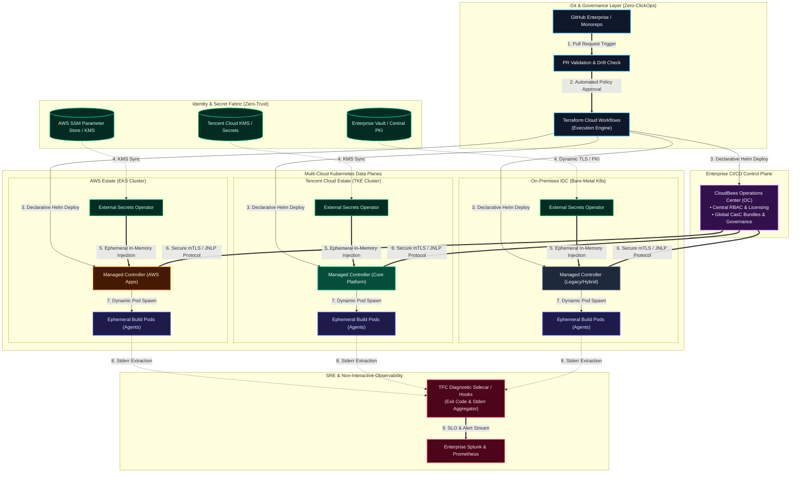
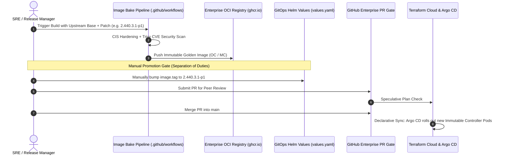

# Enterprise Multi-Cloud CI/CD Zero-Trust Architecture Blueprint

[](https://github.com/GRayMillerDes/multicloud-cicd-zero-trust-architecture)
[](https://external-secrets.io/)
[](https://aws.amazon.com/)
[](https://www.cloudbees.com/)
[](https://prometheus.io/)
[](https://opensource.org/licenses/Apache-2.0)

> **Hands-on Runnable Sandbox**: To deploy and test the local multi-node Kind & GitOps environment that mirrors this architecture, visit [hybrid-gitops-sre-lab](https://github.com/GRayMillerDes/hybrid-gitops-sre-lab).

This repository provides production-grade architectural blueprints, security guardrails, and VCS delivery specifications for an enterprise multi-cloud CI/CD platform engineered under strict financial least-privilege standards.

---

## Quickstart: Consuming & Applying This Blueprint

This repository is designed as an Enterprise Architecture Toolkit. To validate, inspect, and apply these architectural assets:

### 1. Test & Dry-Run the Security RBAC Policy
Validate the production zero-interactive-exec RBAC matrix against your existing Kubernetes cluster:
```bash
# Perform dry-run client side validation of the least-privilege RBAC definitions
kubectl apply --dry-run=client -f ./specs/least-privilege-rbac-matrix.yaml
```

### 2. Inspect Specifications & Hardening Rules
- **[Deep-Dive Architecture Guide](./architecture/architecture-deep-dive.md)**: Executive problem statement, control plane vs data plane segregation, mTLS JNLP tunnels, in-memory secret lifecycle.
- **[Zero-Trust Guardrails](./specs/zero-trust-guardrails.md)**: CIS Kubernetes benchmark hardening rules and automated drift detection specifications.
- **[Terraform Cloud VCS Spec](./specs/terraform-cloud-vcs-spec.md)**: GitHub Enterprise PR iteration, speculative plan checks, remote runners & zero-clickops.

### 3. Deploy the Companion Runnable Sandbox
To spin up a live 3-node Kind cluster reproducing this architecture (Argo CD, ESO, Prometheus, Grafana) locally on your workstation:
```bash
git clone https://github.com/GRayMillerDes/hybrid-gitops-sre-lab.git
cd hybrid-gitops-sre-lab && ./scripts/setup-local-env.sh
```

---

## Architecture Deep-Dive Highlights

Detailed technical breakdowns are documented in **[architecture-deep-dive.md](./architecture/architecture-deep-dive.md)**. Below are the key system mechanisms:

1. **Control Plane vs. Data Plane Segregation**:
   The central management plane (CloudBees Operations Center) handles RBAC, licensing, and global configuration bundles. Workload execution is delegated to isolated regional data planes (AWS EKS, Tencent Cloud TKE, Bare-Metal IDC).
2. **Outbound-Only mTLS JNLP Networking**:
   Controllers establish outbound-only secure tunnels back to the control plane, eliminating inbound firewall rules into private VPCs.
3. **Zero-Secret In-Memory Lifecycle**:
   Credentials never touch Git or `terraform.tfstate`. External Secrets Operator (ESO) reconciles secrets directly from AWS SSM / Tencent Cloud KMS / Vault into ephemeral cluster memory.
4. **Traffic Localization & Zero Egress**:
   Dynamic build agents are spawned strictly within local VPCs where source code and caches reside, preventing cross-cloud latency and egress fees.

👉 *[Read Complete Architectural Specification →](./architecture/architecture-deep-dive.md)*

---

## Architectural Topology




---

## VCS Pipeline & Release Governance Specification

Detailed delivery flows are codified in **[terraform-cloud-vcs-spec.md](./specs/terraform-cloud-vcs-spec.md)**. All infrastructure and controller version upgrades follow dual-control GitOps iteration:



👉 *[Read Complete VCS & Promotion Specification →](./specs/terraform-cloud-vcs-spec.md)*

---

## Security & Compliance Specifications Matrix

Production policies from **[least-privilege-rbac-matrix.yaml](./specs/least-privilege-rbac-matrix.yaml)** and **[zero-trust-guardrails.md](./specs/zero-trust-guardrails.md)** are summarized below:

| Compliance Domain | Enforced Specification | Implementation Artifact | Threat Prevented |
| :--- | :--- | :--- | :--- |
| **Interactive Access** | Zero `kubectl exec` / `attach` | [`least-privilege-rbac-matrix.yaml`](./specs/least-privilege-rbac-matrix.yaml) | Eliminates shell escalation & unauthorized data tampering (PCI-DSS) |
| **Container Sandbox** | `readOnlyRootFilesystem: true`, `drop: ALL` | [`zero-trust-guardrails.md`](./specs/zero-trust-guardrails.md) | Blocks malicious binary downloads & Linux kernel privilege escalation |
| **Workload Identity** | Non-root UID `1000`, `RuntimeDefault` seccomp | [`zero-trust-guardrails.md`](./specs/zero-trust-guardrails.md) | Prevents container breakout to host node |
| **State Sanitization** | External Secrets Operator (In-Memory K8s Secrets) | [`architecture-deep-dive.md`](./architecture/architecture-deep-dive.md) | Prevents credential leaks in `terraform.tfstate` |
| **Version Drift** | No `:latest` tags / Explicit semver in Git | [`terraform-cloud-vcs-spec.md`](./specs/terraform-cloud-vcs-spec.md) | Guarantees reproducible builds & instant deterministic rollbacks |

---

## Architectural Decision Records (ADR) Summary

| Decision ID | Context & Problem | Decision Made | Trade-offs & Consequences |
| :--- | :--- | :--- | :--- |
| **ADR-001** | Terraform state files store credentials in plaintext when using `helm_release` values. | Adopt External Secrets Operator (ESO) with ephemeral in-memory K8s secrets. | Slightly higher initial CRD reconciliation complexity; completely eliminates credential leakage in CI/CD state. |
| **ADR-002** | Financial compliance forbids `kubectl exec` / SSH into production worker nodes. | Implement non-interactive diagnostic sidecars and stderr extractors in CI runners. | Eliminates manual ad-hoc troubleshooting; enforces deterministic RCA and structured logging. |
| **ADR-003** | Multi-cloud latency and network isolation across AWS, Tencent Cloud, and IDC. | Centralize Control Plane (CloudBees OC) and distribute Data Plane controllers per cloud. | Requires outbound-only mTLS JNLP connectivity; local build pods avoid cross-cloud egress costs. |

---

## Document & Asset Index

| Focus Area | Reference Document | Engineering Scope |
| :--- | :--- | :--- |
| **System Architecture** | **[Deep-Dive Architecture Guide](./architecture/architecture-deep-dive.md)** | Control Plane vs Data Plane segregation, mTLS JNLP tunnels, in-memory secret lifecycle |
| **IaC Delivery & VCS** | **[Terraform Cloud VCS Spec](./specs/terraform-cloud-vcs-spec.md)** | GitHub Enterprise PR iteration, speculative plan checks, remote runners & zero-clickops |
| **Security & Compliance** | **[Least-Privilege RBAC Matrix](./specs/least-privilege-rbac-matrix.yaml)** | Production-grade RBAC enforcing zero-interactive-exec policies across multi-tenant clusters |
| **Hardening Benchmarks** | **[Zero-Trust Guardrails](./specs/zero-trust-guardrails.md)** | CIS Kubernetes benchmark hardening rules and automated drift detection specifications |
| **Runnable Demo** | **[Local SRE Sandbox Repo](https://github.com/GRayMillerDes/hybrid-gitops-sre-lab)** | Local 3-node Kind cluster with ESO, Argo CD, and SRE Golden Signals telemetry |

---

## Repository Layout

```text
multicloud-cicd-zero-trust-architecture/
├── README.md                              # Enterprise Architecture Overview & Navigation
├── architecture/
│   ├── architecture-deep-dive.md          # Technical Deep-Dive: Segregation & In-Memory Secrets
│   ├── multicloud-cicd-topology.svg       # Vector Topology Architecture Diagram
│   ├── multicloud-cicd-topology.png       # High-Resolution Architectural Topology
│   └── multicloud-cicd-topology.mermaid   # Mermaid Source Graph
└── specs/
    ├── least-privilege-rbac-matrix.yaml   # Production Kubernetes RBAC (Zero-Exec Policy)
    ├── terraform-cloud-vcs-spec.md        # Terraform Cloud & GitHub Enterprise VCS Spec
    └── zero-trust-guardrails.md           # CIS Benchmarks & Drift Detection Specifications
```

---

## License

Distributed under the Apache-2.0 License. See [LICENSE](./LICENSE) for details.
