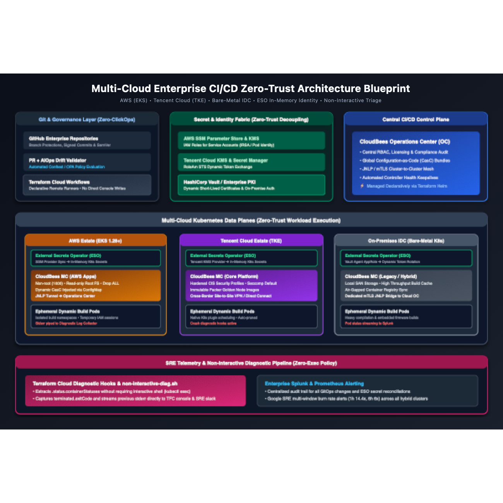

# Enterprise Multi-Cloud CI/CD Zero-Trust Architecture Blueprint

[](https://github.com/GRayMillerDes/multicloud-cicd-zero-trust-architecture)
[](https://external-secrets.io/)
[](https://aws.amazon.com/)
[](https://www.cloudbees.com/)
[](https://prometheus.io/)
[](https://opensource.org/licenses/Apache-2.0)

> **Hands-on Runnable Lab**: To run the local multi-node Kind & GitOps sandbox reproducing this architecture, visit [hybrid-gitops-sre-lab](https://github.com/GRayMillerDes/hybrid-gitops-sre-lab).

This repository contains the architectural blueprints, technical retrospectives, security guardrails, and topology specifications for an enterprise multi-cloud CI/CD platform engineered under strict financial least-privilege policies.

---

## 🗺️ Architectural Topology



```mermaid
graph TB
    subgraph "Git & Governance Layer"
        GH[GitHub Enterprise / Code Repos]
        PR[Pull Request + AIOps Drift Validator]
        TFC[Terraform Cloud Workflows<br/>(Zero-ClickOps Policy)]
    end

    subgraph "Secret & Identity Fabric (Zero-Trust)"
        SSM[AWS SSM Parameter Store / KMS]
        TCC_KMS[Tencent Cloud KMS / Secrets]
        VAULT[Enterprise Vault / Central PKI]
    end

    subgraph "Enterprise CI/CD Control Plane"
        OC[CloudBees Operations Center (OC)<br/>• Central RBAC & Licensing<br/>• Global CasC Bundles]
    end

    subgraph "Multi-Cloud Kubernetes Data Planes"
        subgraph "AWS Estate (EKS)"
            ESO_AWS[External Secrets Operator]
            MC_AWS[Managed Controller - AWS Apps]
            POD_AWS[Ephemeral Dynamic Build Pods]
        end

        subgraph "Tencent Cloud Estate (TKE)"
            ESO_TCC[External Secrets Operator]
            MC_TCC[Managed Controller - Core Platform]
            POD_TCC[Ephemeral Dynamic Build Pods]
        end

        subgraph "On-Premises IDC (Bare-Metal K8s)"
            ESO_IDC[External Secrets Operator]
            MC_IDC[Managed Controller - Legacy/Hybrid]
            POD_IDC[Ephemeral Dynamic Build Pods]
        end
    end

    subgraph "SRE & Non-Interactive Observability"
        LOGS[Terraform Cloud Diagnostic Hooks<br/>(Pod/Sidecar Stderr Aggregator)]
        SPLUNK[Enterprise Splunk / Prometheus]
    end

    %% Flow connections
    GH -->|PR Trigger| PR
    PR -->|Approval Gate| TFC
    TFC -->|Declarative Helm Deploy| OC
    TFC -->|Declarative Helm Deploy| MC_AWS
    TFC -->|Declarative Helm Deploy| MC_TCC
    TFC -->|Declarative Helm Deploy| MC_IDC

    SSM -.->|Async Sync| ESO_AWS
    TCC_KMS -.->|Async Sync| ESO_TCC
    VAULT -.->|TLS / Dynamic Keys| ESO_IDC

    ESO_AWS -->|Secret Injection| MC_AWS
    ESO_TCC -->|Secret Injection| MC_TCC
    ESO_IDC -->|Secret Injection| MC_IDC

    OC ===|JNLP / mTLS Management| MC_AWS
    OC ===|JNLP / mTLS Management| MC_TCC
    OC ===|JNLP / mTLS Management| MC_IDC

    MC_AWS --> POD_AWS
    MC_TCC --> POD_TCC
    MC_IDC --> POD_IDC

    POD_AWS -.->|Diagnostic Stderr| LOGS
    POD_TCC -.->|Diagnostic Stderr| LOGS
    LOGS --> SPLUNK
```

---

## 📚 Core Repository Contents

- 📖 **[Deep-Dive Architecture Guide](./architecture/architecture-deep-dive.md)**: Technical breakdown of control plane vs data plane segregation, JNLP mTLS networking, and in-memory secret lifecycle.
- 💼 **[LinkedIn Pulse Ready Article](./articles/linkedin-pulse-article.md)**: English technical retrospective formatted specifically for LinkedIn Pulse and Featured sections.
- 🇨🇳 **[中文架构实录专栏文章](./articles/technical-retrospective-zh.md)**: 面向知乎、微信公众号、掘金等中文技术社区的深度复盘长文。
- 🛡️ **[Least-Privilege RBAC Matrix](./specs/least-privilege-rbac-matrix.yaml)**: Declarative Kubernetes RBAC configurations enforcing zero-interactive-exec policies.
- 📋 **[Zero-Trust Guardrails](./specs/zero-trust-guardrails.md)**: Hardening benchmarks and automated drift detection specifications.

---

## 💡 Key Architectural Takeaways

1. **Eliminating the Terraform State Credential Leak**: Decoupled secret management via **External Secrets Operator (ESO)** ensures that zero credentials are committed to `terraform.tfstate`.
2. **The "No-kubectl" Dilemma**: Engineered automated diagnostic hooks within Terraform Cloud runners that inspect `.status.containerStatuses` and extract container exit codes and `--previous` stderr streams without granting shell access.
3. **Zero-ClickOps Compliance**: Automated golden machine image pipelines with **HashiCorp Packer** and exclusive declarative scheduling through **Terraform Cloud** revoke human write permissions to public cloud web consoles.

---

## 📄 License

Distributed under the Apache-2.0 License. See [LICENSE](./LICENSE) for details.
