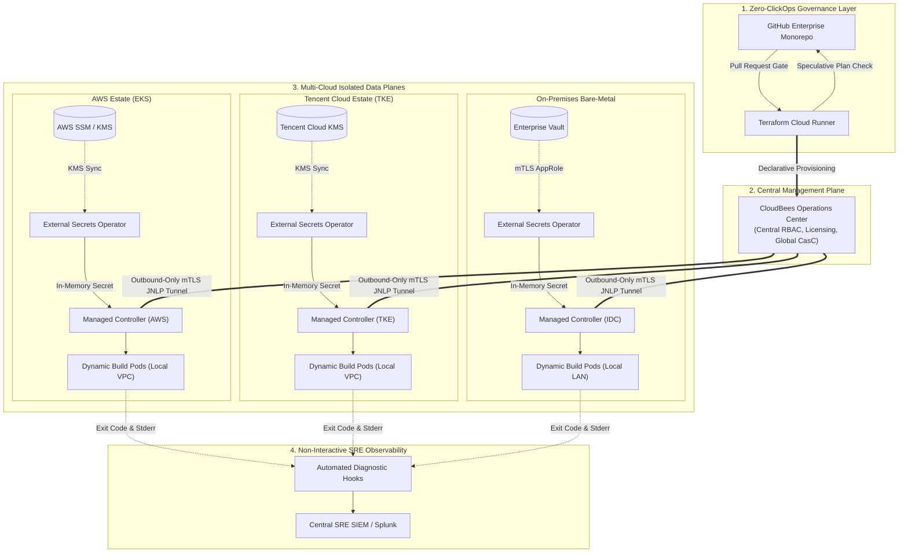

# Multi-Cloud Enterprise CI/CD Zero-Trust Architecture Blueprint

This technical specification details the production architecture for an enterprise-grade, multi-cloud platform engineering fabric spanning **AWS (EKS)**, **Tencent Cloud (TKE)**, and **On-Premises Bare-Metal Kubernetes** under strict financial and gaming compliance policies.

---

## 1. Executive Summary: The Multi-Cloud Compliance Challenge

Enterprises operating multi-region platforms across heterogeneous cloud environments face four compounding operational risks:
1. **Cloud Credential Sprawl**: Storing IAM keys and static tokens across multiple CI/CD systems and Terraform state files creates massive attack surfaces.
2. **Interactive Access Violations**: Global security standards (PCI-DSS, SOC 2, ISO 27001) forbid human shell access (`kubectl exec`, SSH) on production workloads, paralyzing traditional troubleshooting.
3. **Cross-Cloud Egress Costs & Latency**: Running centralized CI/CD builders that cross cloud boundaries introduces severe network latency and expensive inter-cloud data transfer fees.
4. **Configuration Drift**: Manual hotfixes in cloud provider web consoles cause irreversible divergence between infrastructure state and code.

This architecture decouples the **Centralized Control Plane** from **Tenant-Isolated Regional Data Planes**, enforcing Zero-ClickOps and Zero-Trust credential delivery across all cloud providers.

---

## 2. End-to-End Operational Lifecycle & Data Flow



---

## 3. Core Architectural Pillars

### Pillar I: Decoupled Secret Delivery via External Secrets Operator (ESO)
In classic Terraform Helm deployments, secrets are frequently passed using values injections:
```hcl
# ANTI-PATTERN: Commits plaintext credentials directly to terraform.tfstate
values = [
  yamlencode({
    database = {
      password = data.aws_ssm_parameter.db_secret.value
    }
  })
]
```
Even if encrypted in remote S3 buckets, anyone with state access or CI logs can compromise these credentials.

**The Production Solution:**
- Terraform provisions the Kubernetes clusters and installs ESO along with cloud IAM identity bindings (AWS EKS Pod Identity / IRSA, Tencent Cloud CAM role).
- ESO defines `ClusterSecretStore` and `ExternalSecret` custom resources:
  - AWS clusters pull from **AWS SSM Parameter Store / KMS**.
  - Tencent Cloud clusters pull from **Tencent Cloud KMS**.
  - Bare-metal IDC clusters authenticate to **HashiCorp Vault** using short-lived AppRole tokens.
- ESO synthesizes standard Kubernetes `Secret` resources entirely in-memory inside the cluster's etcd, ensuring `terraform.tfstate` remains 100% secretless.

---

### Pillar II: Non-Interactive Troubleshooting Under Least-Privilege Guardrails
In regulated production environments, granting engineers `kubectl exec` violates regulatory audits. When a controller or build sidecar crashes:
- Helm simply times out: `timed out waiting for the condition`.
- Engineers cannot run `kubectl exec -it <pod> -- sh`.

**The Production Solution:**
- Automated post-apply diagnostic hooks are integrated into Terraform Cloud and CI runners.
- On deployment failure, the diagnostic worker calls Kubernetes API endpoints to inspect `.status.containerStatuses`.
- It pinpoints the exact `lastState.terminated.exitCode` (e.g., 137 for OOMKilled, 1 for JVM configuration panic) and queries previous execution logs (`kubectl logs --previous -c <container>`).
- Diagnostics are dumped directly into the pipeline run output, achieving rapid root-cause analysis (RCA) without human access escalation.

---

### Pillar III: Immutable Infrastructure with HashiCorp Packer & Terraform Cloud
To eradicate configuration drift on worker host instances:
- Golden VM machine images (AMIs for AWS, CVM images for Tencent Cloud) are built continuously using **HashiCorp Packer**.
- CIS OS benchmarks, vulnerability scanner agents, and container runtimes are baked in immutably.
- Image IDs are declared in Terraform Cloud workspaces. Node rotations are executed via RollingUpdate without in-place SSH patching.

---

### Pillar IV: Traffic Localization & Cross-Cloud Network Topology
- **Outbound-Only mTLS Control**: Managed Controllers in AWS, TKE, and IDC establish outbound-only secure JNLP tunnels back to the central Operations Center. The control plane does not need direct inbound access into private VPCs.
- **Zero Cross-Cloud Egress for Builds**: Build pods are dynamically scheduled strictly within the local cluster where source code, dependencies, and artifacts reside, eliminating cross-cloud latency and massive egress transfer fees.
