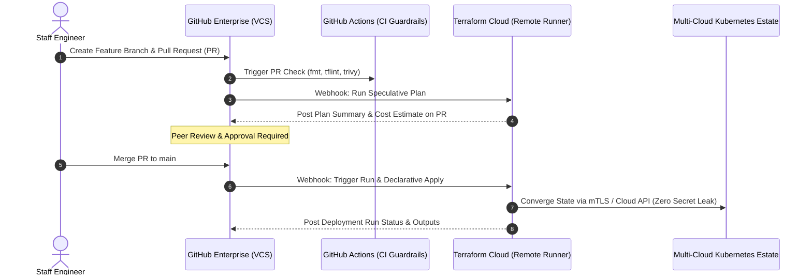
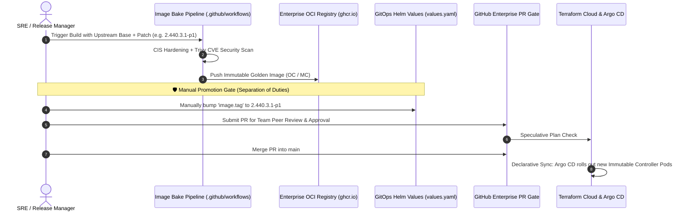

# Terraform Cloud & GitHub Enterprise VCS Integration Architecture

This specification defines how multi-cloud infrastructure and GitOps controller configurations are provisioned and iterated under **Zero-ClickOps** and **Dual-Control Peer Review** standards.

---

## 1. Zero-ClickOps VCS Flow Diagram



---

## 2. Terraform Cloud Workspace Configuration Spec

### 2.1 Workspace Settings
```hcl
# HCP Terraform / Terraform Cloud Workspace Configuration
organization = "enterprise-platform-engineering"
workspaces {
  name = "multicloud-cicd-zero-trust-prod"
}

execution_mode = "remote"   # Runs execute in isolated Terraform Cloud Linux containers
auto_apply     = false      # Production changes require manual promotion or PR gate
```

### 2.2 Variables & Zero-Trust Secret Isolation
| Variable Name | Category | Sensitivity | Purpose |
| :--- | :--- | :--- | :--- |
| `CONFIRM_DESTROY` | Terraform | Plaintext | Safeguard against accidental destruction |
| `TFC_VAULT_RUN_ROLE` | Environment | Sensitive | Dynamic OIDC Token for Vault / AWS IAM role assumption |
| `KUBE_CONFIG_DATA` | Environment | Sensitive | Encrypted cluster connection context |

---

## 3. GitHub Enterprise Branch Protection Rules

To prevent unilateral state modification, the `main` branch must enforce:
1. **Require a pull request before merging**: Minimum 1 senior review approval.
2. **Require status checks to pass before merging**:
   - `1. IaC Lint & Security Scan` (Trivy, Terraform validate)
   - `Terraform Cloud/enterprise-platform-engineering/multicloud-cicd-zero-trust-prod` (Speculative plan success)
3. **Require signed commits**: GPG / SSH verified commits only.
4. **Include administrators**: Enforces the same rules on organization owners.

---

## 4. Golden Image Lifecycle & Manual Helm Version Promotion

In enterprise platform governance, controller base image builds and production cluster deployment are **strictly decoupled** to maintain change traceability:



### 4.1 Release Gate Policies
1. **No `:latest` Tags**: All image versions must be pinned to explicit semver and patch tags (e.g., `2.440.3.1-p1`).
2. **Explicit Human Review**: Image tags must be updated manually via Pull Request in `gitops/charts/cloudbees-mc-template/values.yaml` to ensure deliberate change approvals and clean git commit audit trails.
3. **Rollback Determinism**: Because image tags are explicitly tracked in Git, rolling back to any previous controller release requires only a standard `git revert`.
